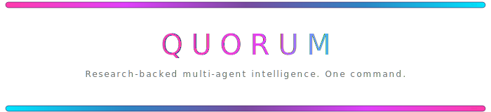
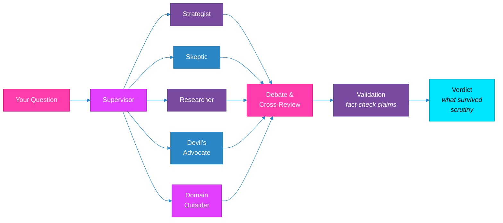
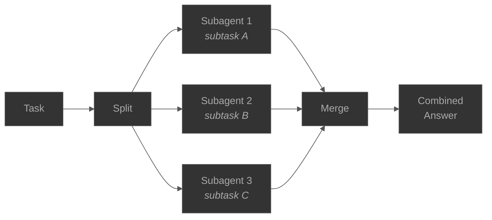
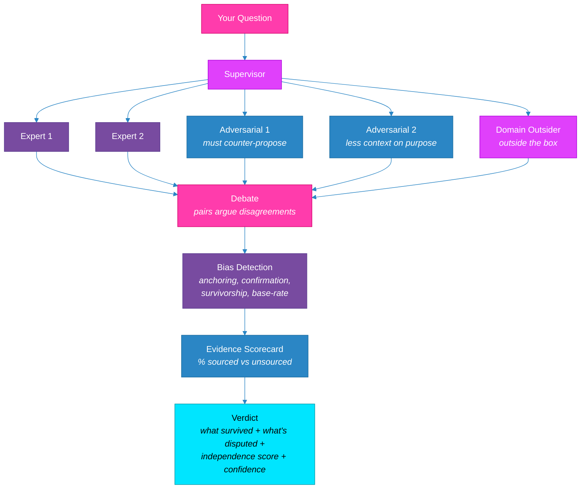
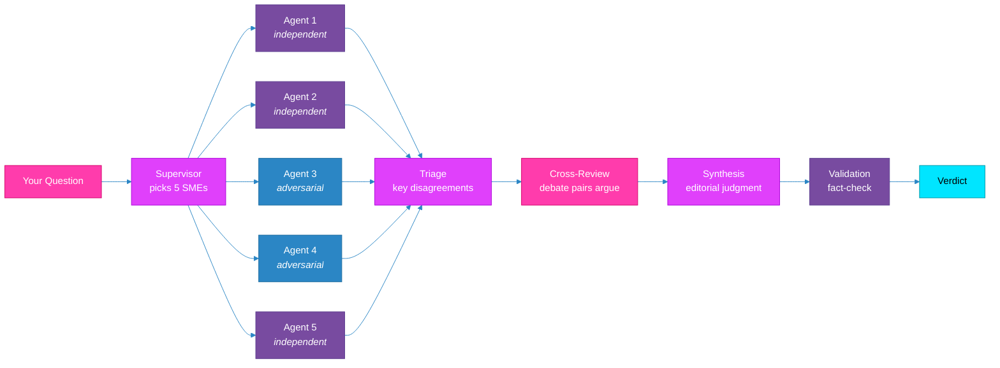
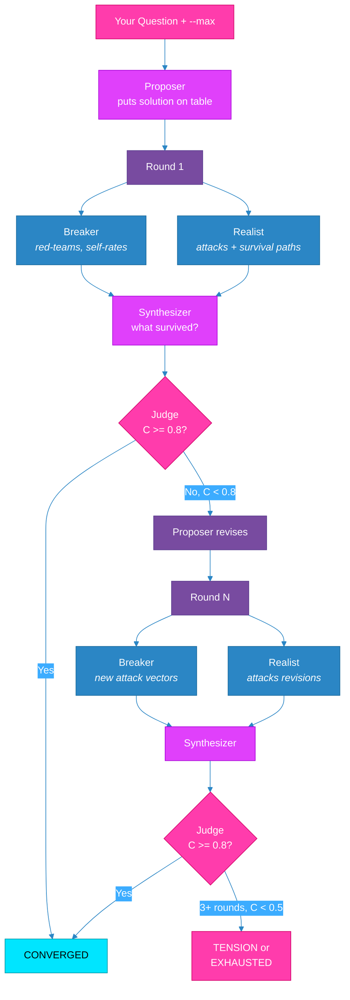
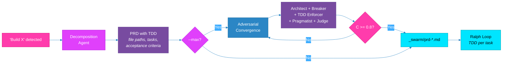
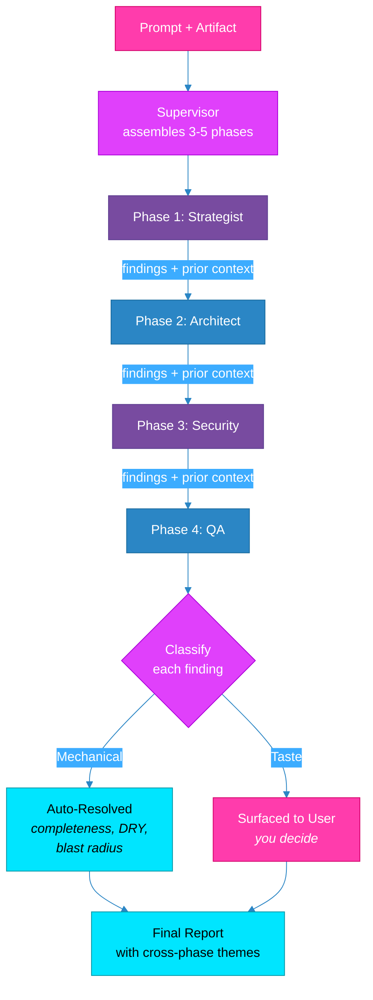

<picture>
  <source media="(prefers-color-scheme: dark)" srcset="docs/assets/header-dark.svg">
  <source media="(prefers-color-scheme: light)" srcset="docs/assets/header-light.svg">
  
</picture>

[](https://github.com/qinnovates/quorum/releases) [](LICENSE) [](https://claude.ai/code) [](docs/ARCHITECTURE.md) [](docs/GUIDE.md)

When you ask AI a question, you get one answer. It sounds confident. It might be completely wrong. You have no way to know.

Ask 5 AI agents the same question and you get 5 answers that sound different but were generated from the same training data, the same priors, the same blind spots. Most multi-agent tools just split work across agents and merge the results. That's parallel labor, not parallel thinking. If all 5 agents hallucinate the same thing, you get a well-formatted wrong answer with extra steps.

**Quorum is different.** It's built on psychology, philosophy, and math.

The psychology: a group's IQ is not the average of its members' IQs. It's an emergent property of *how they communicate*. Groups where every participant contributes equally are measurably smarter than groups dominated by one expert, even the smartest person in the room (Woolley et al. 2010, 699 subjects). Quorum enforces equal turns structurally, not by suggestion.

The philosophy: Socrates didn't lecture. He questioned. He found what you believed and asked why until the belief either held or collapsed. Plato documented the method. 2,400 years later, academics still use it because nothing better has replaced it. Quorum's adversarial agents do the same thing. They don't just disagree. They ask "why does this hold?" and "what breaks it?" until the answer either survives or doesn't.

The math: every synthesis is scored by a convergence formula, checked for 4 cognitive biases, measured for agent independence, and graded by evidence sourcing. Not vibes. Not vote counts. Measured signals with thresholds that determine whether a conclusion is battle-tested or still contested. [Full methodology ->](docs/ARCHITECTURE.md#structured-reasoning-metrics)

The result: answers that have been **questioned, attacked, defended, and validated** before you see them. One command. Two minutes.

```
/quorum "your question here"
```

Built by [qinnovate](https://qinnovate.com) | [Full docs](docs/ARCHITECTURE.md)

---

## What You Get

```
═══════════════════════════════════════════════════
QUORUM VERDICT — 5 agents, 2 adversarial, 1 round
═══════════════════════════════════════════════════

EXECUTIVE SUMMARY
PostgreSQL. The panel reached strong consensus (4-1) that PostgreSQL
is the right choice for a service with relational data, complex queries,
and no hyperscale write requirements. The dissenting agent (Cloud
Architect) argued DynamoDB wins on operational simplicity at scale,
but could not demonstrate a query pattern that requires it.

DISAGREEMENT REGISTER
  Cloud Architect (MINORITY): "DynamoDB eliminates connection pool
  management entirely. At 10K concurrent connections, PostgreSQL
  requires PgBouncer and careful tuning."
  → Rebuttal (Database Engineer): "RDS Proxy handles this. The
  operational cost is one config change, not an architecture change."

CONFIDENCE: HIGH (4 of 5 sourced claims verified)
EVIDENCE SCORECARD: 8 claims, 6 STRONG, 1 MODERATE, 1 UNSOURCED
INDEPENDENCE SCORE: 0.74 (HIGH)
BIAS FLAGS: None triggered

PRIORITY ACTIONS
1. Use PostgreSQL on RDS with read replicas
2. Design partition key now even if staying relational (future optionality)
3. Set up PgBouncer or RDS Proxy from day one
═══════════════════════════════════════════════════
```

That took 2 minutes. One command.

## Quick Start

```bash
# Install
claude install qinnovates/quorum

# Ask anything — 5 agents, auto-configured
/quorum "Should we use PostgreSQL or DynamoDB for our new service?"
```

That's it. Quorum picks the right experts, makes them debate, and delivers what survived scrutiny. Everything below is details.

## The Problem With AI Research Today

You already know single-agent AI hallucinates. So you try multi-agent. You split work across subagents, collect results, merge them. Feels safer. It's not.

**The echo chamber problem.** All your agents share the same base model, the same training data, the same priors. When Agent 1 and Agent 3 both say "use DynamoDB," that feels like independent confirmation. It isn't. They reached the same conclusion from the same statistical distribution. You didn't get two opinions. You got one opinion twice.

**The duplicate effort problem.** Without structural coordination, agents research the same sources, follow the same search terms, cite the same top Google results. You're burning 5x the tokens for 1.2x the coverage. Quorum gives each agent asymmetric context and different search strategies on purpose.

**The missing challenge problem.** Splitting work and merging results is collaboration. It is not scrutiny. Nobody asked "what if this is wrong?" Nobody tested whether the conclusion survives attack. Nobody checked if the sources actually say what the agents claim they say. The answer was assembled, not stress-tested.

**The groupthink problem.** When all agents converge on the same answer, most tools treat that as high confidence. Quorum treats it as the highest-risk scenario. Unanimous consensus triggers MORE scrutiny, not less. Because in groups, agreement without challenge is the most dangerous signal there is (Janis 1972). Quorum's 6 anti-boxing rules structurally prevent echo chambers: domain outsiders are injected from outside your profile, adversarial agents can never be pruned for "efficiency," and exploratory queries invert the agent roster to spawn perspectives you didn't ask for.

### How every other AI tool works


One model. One perspective. Sounds confident. Could be completely wrong. No way to know.

### How Quorum works



Five experts. Independent work. Mandatory dissent. The answer that survives pushback is the one worth trusting.

---

### How other multi-agent tools work

**Claude Code subagents** (built-in `Agent` tool):



Split task, collect parts, merge. Great for parallelizing work. But no agent challenges another. No adversarial review. No fact-checking. If all 3 hallucinate the same thing, you get a confident, well-formatted wrong answer.

**Other multi-agent solutions** (sequential review pipelines):


Sequential single-agent reviews. Each reviewer sees the plan in isolation. No debate between reviewers. No convergence math. No bias detection. The "second opinion" may be a different model, but it still just agrees or disagrees — it doesn't have to defend its position against attack.

**Quorum:**



Parallel agents with **mandatory dissent**. Critics must counter-propose, not just attack. Outsiders break groupthink by design. Every synthesis checked for 4 cognitive biases. Every claim classified as sourced or unsourced. The answer you get has been **stress-tested**, not just **reviewed**.

| | Claude Subagents | Other Solutions | Quorum |
|--|-----------------|-----------------|--------|
| **Topology** | Parallel split-merge | Sequential single-agent reviews | Parallel debate + adversarial convergence |
| **Adversarial** | None | Cross-model second opinion, no structured attack | 2+ mandatory critics per panel, counter-proposals required |
| **Bias Detection** | None | None | 4 cognitive bias checks per synthesis |
| **Evidence Scoring** | None | None | Every claim graded STRONG/MODERATE/WEAK/UNSOURCED |
| **Convergence Math** | None | None | C = A(0.5) + N(0.3) + D(0.2), scored per round |
| **Anti-groupthink** | None | Different model | 6 structural anti-boxing rules, domain outsider injection |

**What makes Quorum different:**

- **Cognitive Diversity Profiles** — each agent gets a unique cognitive profile (risk tolerance, skepticism, abstraction level) that creates productive tension with their expertise. A security expert forced to see opportunities. A creative forced to pressure-test their own ideas. Same model, genuinely different reasoning. [How CDP works ->](docs/ARCHITECTURE.md#cognitive-diversity-profiles-cdp)
- Agents assigned **opposing positions**, forced to defend them with evidence
- Challenge agents get **less context on purpose** so they can't just agree with everyone
- Research agents search **different sources with different terms** based on their cognitive profile
- The supervisor **judges reasoning quality**, not vote counts
- Every synthesis scored by convergence, independence, bias detection, and evidence sourcing — [full methodology](docs/ARCHITECTURE.md#structured-reasoning-metrics)

## Examples

### For Decisions

```bash
# Quick opinion — 5 agents, done in 2 minutes
/quorum "Should we use PostgreSQL or DynamoDB for our new service?"

# Stress-test a decision — full adversarial convergence
/quorum "Should we build or buy our auth system?" --max

# Settling an argument — auto-routes to dialectic
/quorum "Is a hot dog a sandwich?"

# Career crossroads
/quorum "Making $180K in fintech, offered $140K at a climate startup. Worth the pay cut?"

# Buying a house
/quorum "Found a house for $450K, 1960s build, no inspection. What should first-time buyers worry about?"

# Before a job interview
/quorum "Interviewing at Stripe for senior security. What will they ask I'm not preparing for?"

# Evaluating a business idea
/quorum "App that matches dog owners for group walks. Business or feature?" --max
```

### For Building

```bash
# Auto-detects superpower mode, generates battle-tested PRD
/quorum "Build a REST API for user auth with JWT" --max

# Review a document
/quorum "Review this contract for risks I might miss" --artifact contract.pdf

# Sequential review pipeline — assembles domain-appropriate reviewers
/quorum "Review our payment flow for PCI compliance" --reviewers --artifact payment-flow.md

# Research landscape — auto-routes to web research
/quorum "Complete landscape of EEG-based authentication methods"

# Exhaustive red team at scale
/quorum "Red team our auth system — every attack vector" --set 100

# Massive scale prediction — swarm auto-engages at 20+
/quorum "Will BCI startups consolidate or fragment by 2028?" --set 200

# Private, no web searches
/quorum "Evaluate our internal security posture" --artifact audit.md --no-web

# See the plan before spending tokens
/quorum "Microservices or monolith?" --max --dry-run
```

## Options

**Four tiers:**

| Tier | Flag | Agents | What Happens |
|------|------|--------|-------------|
| Default | *(none)* | 3-8 | SME panel debates, supervisor synthesizes |
| Max | `--max` | 7-15 | Full adversarial convergence with iterative rounds. Subsumes the old `--converse` flag. Teams/dialectic/superpower auto-selected as needed |
| Reviewers | `--reviewers` | 3-5 phases | Sequential review cascade, auto-decide mechanical findings, surface taste calls |
| Custom | `--set N` | N | At 20+, swarm architecture auto-engages (same as `--swarm`) |

**Five optional flags:**

| Flag | Why It Can't Be Auto-Detected |
|------|-------------------------------|
| `--artifact PATH` | Supervisor can't know which file you mean |
| `--reviewers` | User wants vertical sequential review, not horizontal debate |
| `--no-web` | Privacy choice only the user can make |
| `--ponder` | User explicitly wants Q&A before the swarm runs |
| `--dry-run` | User wants to see the plan without spending tokens |

**Everything else is auto-detected:**

| What You Say | What Fires | How It's Detected |
|-------------|-----------|-------------------|
| "Should we use X or Y?" | Dialectic (2 agents, Socratic rounds) | Binary question pattern |
| "Build a REST API for..." | Superpower (PRD + TDD + Ralph loop) | Implementation intent: "build", "implement", "create", "add feature" |
| "Review this" + `--artifact` | Review mode (agents analyze the file) | Artifact present + review/audit/validate language |
| "What am I missing about..." | Explore mode (reframe the question) | Meta-question / exploratory language |
| "EEG auth methods landscape" | Research mode (web search + synthesis) | Open knowledge question without artifact |
| Any question at `--max` | Adversarial convergence (iterative rounds) | `--max` always uses converse mode internally |
| Any question at `--set 20+` | Swarm (MECE taxonomy + environment) | Agent count >= 20 |
| 3+ domains detected | Teams (internal deliberation, cross-challenge) | Supervisor detects domain count |
| Forecasting question at `--set` | Prediction mode (sentiment + coalitions) | "Will X happen", "by 2028", future-tense patterns |

## How It Works

### Default Mode (3-8 agents)



1. **Setup** — Supervisor analyzes your question, picks experts with diverse perspectives. Minimum 2 adversarial
2. **Independent work** — All agents work in parallel, no one sees anyone else's output
3. **Triage** — Supervisor reads all reports, drops low-value agents, identifies key disagreements
4. **Cross-review** — Selected agents debate each other directly. Devil's Advocate challenges the majority
5. **Synthesis** — Supervisor authors the final report with editorial judgment
6. **Validation** — Adversarial reviewer challenges the synthesis (web fact-check preferred; same-session agent review as fallback — see [Limitations](#honest-limitations))
7. **Final report** — What survived, what's disputed, what to do next

### Max Mode (7-15 agents, `--max`)



The full panel iterates across rounds until a solution survives sustained attack. Five core roles:

| Role | What They Do |
|------|-------------|
| **Proposer** | Goes first. Defends and adapts across rounds. |
| **Realist** | "This fails because X, and here's what survives X." Every criticism includes a survival path. |
| **Breaker** | Red-teams the proposal. Self-rates attacks. "I can't break this" = strongest signal. |
| **Synthesizer** | Reports what survived and what collapsed at checkpoints. |
| **Judge** | Neutral arbiter. Computes convergence score. Ends when C >= 0.8 (max 6 rounds). |

**Anti-duplication:** No repetition across rounds. "This won't work" is not allowed. Must include what WOULD work. No free nihilism. The 40/60 adversarial-to-constructive ratio is calibrated: AI debate performance drops at 4+ adversarial agents from context overload (Liang et al. 2023), and authentic critics outperform assigned devil's advocates (Nemeth 2001).

**Three outcomes:** CONVERGED (survived attack) / TENSION (irreducible tradeoff — user decides) / EXHAUSTED (diminishing returns).

The supervisor also auto-selects structure as needed:
- **Teams** — if 3+ domains with different incentives. Teams deliberate internally, leads cross-challenge. Socrates questions weakest points, Plato audits evidence
- **Dialectic** — if the question is binary or philosophical. 2 agents drill through contradiction across rounds
- **Superpower** — if the query is "build X". Generates PRD with TDD + acceptance criteria, stress-tests it, outputs Ralph loop command

**Swarm (20-1000+ agents, `--set N`):**
- **Partition Engine** — MECE taxonomy, each agent gets a unique territory
- **Environment Server** — shared state, agents POST/REACT/HANDOFF/SHIFT (prompt-orchestrated, not a runtime service)
- **Pattern Detection** — supervisor reads emerging patterns, not individual reports
- **Prediction mode** — auto-detected for forecasting questions ("will X happen by Y?")

**[Full architecture documentation ->](docs/ARCHITECTURE.md)**

## Superpower Mode (Auto-Detected)

When you say "build", "implement", "create", "scaffold", "write a", "set up", or "add feature", the supervisor auto-triggers the superpower pipeline. No flag needed.

```bash
/quorum "Build a REST API for user auth with JWT" --max
```



**What happens:**

1. Supervisor detects implementation intent ("Build") -> triggers superpower pipeline
2. **Decomposition agent** generates a PRD with TDD enforcement:
   - Exact file paths for every file created or modified
   - Bite-sized tasks (one action each, 2-5 minutes)
   - Each task: write failing test -> verify fail -> implement -> verify pass -> commit
   - Machine-verifiable acceptance criteria (not "works correctly" but "returns 200 with valid JWT containing user_id claim")
3. **Adversarial convergence** stress-tests the PRD (only with `--max`):
   - Architect: "Are the boundaries right? Missing abstractions?"
   - Breaker: "Which acceptance criteria are ambiguous? Edge cases?"
   - TDD Enforcer: "Is every task actually testable? Assertions specific enough?"
   - Pragmatist: "Is this over-engineered? Can tasks be eliminated?"
   - Judge: Computes convergence score. Declares READY or sends back for revision.
4. **Output:** `_swarm/prd-{name}.md` — ready for implementation

**The Ralph loop** executes each PRD task with fresh context: reads PRD + progress.md -> picks next task -> TDD (test -> fail -> implement -> pass -> commit) -> updates progress -> every 3 tasks runs Quorum review to catch regressions -> repeats until done.

**Note:** Ralph loop is local-only. Not included in the published marketplace version.

| | `/quorum "Build X"` | `/quorum "Build X" --max` |
|--|---------------------|--------------------------|
| PRD generation | 3-8 agents (lighter) | 7-15 agents (full decomposition) |
| Stress-test | No adversarial review | Full convergence (5 personas, C >= 0.8) |
| Output quality | Good for small features | Production-grade for complex systems |

No `--superpower` flag exists. Same capability, zero cognitive load.

## Reviewers Mode (`--reviewers`)

Top-down sequential review pipeline. Unlike default Quorum (horizontal debate), `--reviewers` runs phases in cascade — each phase's output feeds the next. Personas are dynamically assembled based on the prompt topic, not hardcoded.

```bash
/quorum "Review this API design for production readiness" --reviewers --artifact api-spec.md
```



**How it works:**

1. **Intake & Assembly** — Supervisor reads the prompt, assembles 3-5 review phases with topic-appropriate personas (e.g., Security: Threat Modeler -> Architect -> Penetration Tester -> Compliance)
2. **Sequential Review** — Each phase runs one reviewer who receives the original prompt + artifact + ALL prior phase outputs. Findings are classified as **Mechanical** (auto-decidable) or **Taste** (needs human judgment)
3. **Auto-resolution** — Mechanical findings are auto-resolved using decision principles (completeness, blast radius, pragmatic, DRY, explicit over clever, bias toward action)
4. **Final Gate** — Only taste decisions surface for your approval. Cross-phase themes are highlighted

| | Default (horizontal) | --max (adversarial) | --reviewers (vertical) |
|--|---------------------|--------------------|-----------------------|
| Topology | Flat panel | Iterative convergence | Sequential cascade |
| Agent relationship | Peers debate | Attackers vs defenders | Each builds on previous |
| Decision style | Emerges from debate | Survives sustained attack | Auto-decided, taste surfaced |
| Best for | Ambiguous questions | Stress-testing decisions | Reviewing concrete artifacts |

## Rules for Prompts That Don't Produce Garbage

1. **Name the exact pipeline, not the app.** "Fix the detection pipeline" not "fix Spot"
2. **State the current broken state.** "Currently nothing detects" not "make it work"
3. **Attach the design doc.** `--artifact` gives the AI the spec, not vibes
4. **One pipeline per prompt.** Don't combine LiDAR + detection + onboarding + App Store
5. **Include a constraint verb.** "Trace before touching code" forces investigation before editing

The single best improvement: **always include `--artifact` pointing to your design doc.**

## Validation & BS Detection (5 Layers)

| Layer | What It Does |
|---|---|
| Source Grading | Every finding rated STRONG / MODERATE / WEAK / UNVERIFIED |
| Contradiction Check | Catches when agents disagree AND when they agree without evidence |
| Hallucination Red Flags | Supervisor checklist for fabricated stats, fake citations, too-clean numbers |
| Adversarial Validation | Reviewer challenges the synthesis (web search preferred, subagent with fresh context, or same-session agent review as fallback) |
| Transparent Output | Report shows what's verified, what's unresolved, what couldn't be checked |

**The rule: If it can't be sourced, it gets flagged. If it can't be verified, it says so. If agents disagree, both sides are shown. You decide — not the AI.**

Every synthesis also includes: convergence score, bias detection (4 cognitive bias checks), independence metric, and evidence scorecard. [Full methodology ->](docs/ARCHITECTURE.md#structured-reasoning-metrics)

## Anti-Boxing (6 Rules)

When you give an AI a project profile and a classification gate, it starts only pulling from familiar domains. The profile IS the box. Anti-boxing is Quorum's structural guarantee that the system keeps reaching outside its comfort zone.

1. **Domain Outsider never from the profile's default domains.** The outsider's value comes from NOT being in the profile
2. **Classification gate scores the question, not the project.** A business question in a research repo gets business agents
3. **Condition-based outsider injection.** High consensus with low challenge -> inject a lateral thinker
4. **Exploratory queries invert the profile.** "What am I missing?" spawns from domains the profile doesn't list
5. **Adversarial agents are immune to pruning.** Devil's Advocate and Provocateur can never be killed by efficiency rules
6. **Inverted early termination.** When everyone agrees, scrutiny goes UP. Unanimous consensus is the highest-risk scenario

## The Science

**Group intelligence has nothing to do with individual IQ.**

That's the finding. Not an opinion. A measured result from 699 people solving brainstorming, moral reasoning, negotiation, and visual puzzles in groups of 2-5 (Woolley et al. 2010). The smartest individual in the group didn't predict performance. Neither did average IQ, motivation, or satisfaction.

What did predict it: **equal conversational turn-taking.** Groups where everyone contributed roughly equally were measurably smarter than groups dominated by one person.

That's why Quorum defaults to 5 agents with mandatory equal participation. Not because 5 is a round number. Because it's the research-backed ceiling where every agent can still contribute equally. At 7, conversational inequality becomes unavoidable (Dunbar's synchronous layer). 3-agent AI debate already outperforms single-agent output (Du et al. 2023). Adding a supervisor + adversarial agent to reach 5 optimizes the diversity-coherence tradeoff.

**One dissenter cuts groupthink by 85%.** A single person who disagrees drops conformity from 32% to 5% (Asch 1951). That's why Quorum's adversarial minimum is 2, not 1.

**One dissenter is dismissed as eccentric. Two establish a pattern.** A lone critic gets ignored. Two critics with the same position create a credible minority that the majority can't dismiss (Moscovici 1969). That's why 2 is the minimum, not the maximum.

**Assigned devil's advocates make people MORE entrenched, not less.** If you tell someone "argue the other side," the group digs in harder. Critics must hold authentic positions with genuine counter-proposals to change minds (Nemeth 2001). That's why Quorum agents defend real positions, not assigned ones.

**Critics who propose alternatives produce 34% better decisions than critics who only attack.** Saying "this won't work" is free nihilism. Saying "this won't work, and here's what would" produces measurably higher decision quality (Schweiger 1986). That's why Quorum requires counter-proposals. No free attacks.

**Caveat on the science:** Woolley studied humans with genuinely different knowledge and cognitive styles. Quorum uses multiple instances of the same base model. The transfer is theoretical, not proven. Du et al. (2023) validates that multi-agent AI debate improves output. But the specific Woolley mechanism (emergent collective intelligence from conversational equality) has not been independently confirmed in LLM systems. Quorum's architecture is designed as if the mechanism transfers, and empirically it produces better results. We don't claim the cognitive science is settled for AI.

## Output Format

Every standard report includes:
- **Executive Summary** — 3-5 sentences, degree of consensus, key finding
- **Supervisor's Assessment** — The quorum's own judgment (most valuable section)
- **Confidence & Verification** — What's backed by evidence vs. supervisor judgment
- **Disagreement Register** — Unresolved disputes with both positions preserved
- **Priority Actions** — Ranked by impact, not by how many agents mentioned them
- **Blind Spots** — What the team collectively could not evaluate

Converse mode adds:
- **Attack Resistance Map** — Each surviving component and which attacks it withstood

Swarm reports add:
- **Emergent Consensus** — Findings agents in unrelated territories reached independently (strongest signal)
- **Polarizations** — Genuine disagreements with evidence on both sides
- **Cascades** — Findings that changed the swarm's trajectory
- **Coalition Map** — Which territory groups aligned on which recommendations
- **Sentiment Trajectory** — How the swarm's collective position evolved across rounds

## Honest Limitations

Quorum is a reasoning quality tool, not a magic truth machine.

1. **The validation gate is not truly independent.** Even mild social influence narrows group diversity (Lorenz et al. 2011). The adversarial reviewer uses a separate agent in the same Claude session. That's prompt-level independence, not structural independence. Web search fact-checking provides genuinely independent evidence. Agent review provides useful but limited adversarial pressure. Neither substitutes for human review.

2. **The environment server is simulated.** Swarm mode's Environment Server and Pattern Detection are prompt-orchestrated, not a persistent runtime service. The quality of pattern detection depends on summarization quality, not a dedicated algorithm. True O(patterns) scaling is a design goal, not a current guarantee.

3. **Agent count scaling is heuristic.** The research supports specific tiers: 3 (minimal), 5-7 (synchronous optimum per Dunbar/Woolley), then jump to asynchronous/swarm. Intermediate counts (8, 10, 14) are interpolated, not research-derived.

4. **Hallucination is structural.** No amount of multi-agent debate eliminates hallucination. Quorum makes it visible and reduces it. It does not and cannot eliminate it. Every report is a starting point for human judgment. [Why hallucination can't reach zero ->](#on-hallucination)

## On Hallucination

**Hallucination is math, not a bug.**

No LLM is hallucination-proof. Not GPT-4. Not Claude. Not any model running inside Quorum.

Every transformer output is a probability sample, not a fact lookup (Vaswani et al. 2017). Language modeling and lossless compression are mathematically equivalent (Deletang et al. 2024). But a model with finite parameters cannot losslessly encode a training corpus with greater entropy (Shannon 1948). The weights are lossy compression. Lossy decompression produces artifacts. In images, JPEG blocks. In language models, hallucinations (Chlon et al. 2025). The math does not permit zero error.

Biological brains do the same thing. They reconstruct memories from statistical patterns rather than retrieving stored records (Bartlett 1932, Schacter 1999, Loftus & Palmer 1974). McCulloch & Pitts (1943) modeled artificial neural networks on exactly this mechanism. Both systems fill gaps with plausible guesses. The difference is that we built the LLM, so we can study the mechanism.

Quorum's 5-layer validation pipeline, adversarial agents, and evidence audits reduce hallucination. They make it *visible*. They do not eliminate it. Every Quorum report is a starting point for human judgment, not a replacement for it.

**[Full scientific explanation with citations ->](docs/SAFETY.md#0-on-hallucination-why-no-llm-is-hallucination-proof)**

<details>
<summary><strong>Version History</strong></summary>

### v7.1.0 — Cognitive Diversity Profiles (2026-03-28)
Each agent gets a 3-axis cognitive profile (risk tolerance, skepticism, abstraction) that creates productive tension with their persona. Anti-stereotypical assignment via fixed lookup table. Parameter-adjusted convergence formula (C*). CDP specification in ARCHITECTURE.md. Devil's advocate stress-test on the math. Validation protocol defined.

### v7.0.0 — Structured Reasoning Metrics & Collective Intelligence (2026-03-28)
Convergence formula with weight rationale. Bias detection (anchoring, base-rate neglect, confirmation, survivorship). Independence Score formula. Anti-Hallucination Scorecard with risk thresholds. Auto-detection table for all modes. "The Science" section explaining Woolley et al. collective intelligence foundation. Woolley-to-AI transfer caveat added. Flag documentation reconciled. README restructured for clarity.

### v6.0.0 — Reviewers Mode (2026-03-26)
Sequential review pipeline (`--reviewers`). Dynamic persona assembly per topic. Mechanical/taste finding classification. Auto-resolution with decision principles. Converse mode prompts documented.

### v5.2.0 — Converse Mode (2026-03-22)
Research-backed iterative adversarial convergence. 5-7 agents, 40/60 adversarial ratio, 10 peer-reviewed citations. Adversarial minimum raised from 1->2 for all swarm sizes >=5 (Moscovici 1969). Validation gate honesty disclosure. Swarm O(patterns) honesty disclosure.

### v5.1.0 — Outcome Predictor (2026-03-22)
Outcome Ledger, Calibrate mode, Monitor mode, Structured Seed Data, Visualization Export, Temporal Simulation.

### v5.0.0 — Swarm Mode (2026-03-22)
20-1000+ agents with MECE taxonomy, environment-based coordination, activation scheduling, prediction mode. Inspired by MiroFish/OASIS.

### v4.1.0 — Divergence Engine (2026-03-17)
Provocateur archetype, EXPLORE mode, structural protections, security hardening.

### v4.0.0 — Adaptive Intelligence (2026-03-17)
Project Profiles, Task Classification Gate, Config Transparency Block, Adaptive Output Templates.

### v3.2.0 — Security Hardening (2026-03-17)
Removed shell access from agent manifest, injection defense, credential detection.

### v3.1.0 — Epistemic Quality Gate (2026-03-17)
Two-stage research + validation workflow. VALIDATED / FLAGGED / BLOCKED verdicts.

### v3.0.0 — Subteams & Dialectic (2026-03-14)
Subteam/Org modes, Socrates + Plato, Dialectic mode, 5-layer validation pipeline.

[Full changelog ->](docs/CHANGELOG.md)
</details>

## Documentation

- **[Usage Guide](docs/GUIDE.md)** — When to use flat vs max vs reviewers vs swarm. Decision matrix, cost guide, examples
- **[Architecture](docs/ARCHITECTURE.md)** — Full phase-by-phase technical specification, structured reasoning metrics (convergence, bias detection, independence, evidence scorecard)
- **[Prompt Templates](docs/PROMPTS.md)** — All agent templates with variable reference
- **[Safety & Privacy](docs/SAFETY.md)** — Guardrails, privacy disclosure, tool permissions
- **[Privacy Policy](https://qinnovate.com/privacy)** — Full privacy policy for all qinnovate tools
- **[Changelog](docs/CHANGELOG.md)** — Version history and what changed
- **[Releases](https://github.com/qinnovates/quorum/releases)** — GitHub releases with download links

## License

MIT

## Author

Kevin Qi — [qinnovate.com](https://qinnovate.com)
